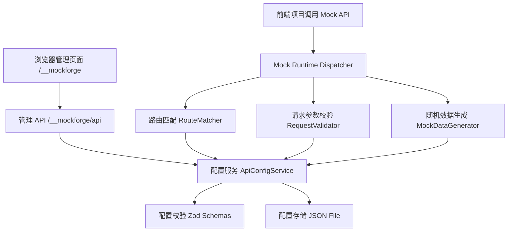
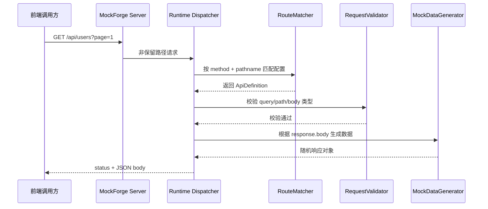

# MockForge 技术设计文档

## 1. 设计目标

MockForge 的技术方案需要优先满足以下目标：

- 作为一个可独立部署的 Web 服务运行。
- 支持用户通过网页创建、编辑、删除 Mock API。
- 支持导入 AI 生成的标准 JSON 配置。
- 根据接口配置动态暴露 HTTP API。
- 每次请求时生成符合响应 schema 的随机数据。
- 保证管理接口、管理页面和用户 Mock API 之间不会发生路径冲突。
- 保持第一版架构简单，方便快速做出 MVP。

## 2. 关键边界

### 2.1 什么需要持久化

第一阶段不持久化“业务响应数据”。也就是说，接口返回的数据每次都可以随机生成，不需要保存用户、订单、商品等模拟业务记录。

但接口配置需要保存。否则用户在网页上创建或导入的接口会在服务重启后全部丢失，无法满足自部署网站长期使用的目标。

因此本设计采用：

- 接口配置持久化。
- Mock 响应数据不持久化。
- 请求调用记录第一阶段不持久化。

### 2.2 什么不做

第一阶段不做：

- 登录注册系统。
- 多用户和多租户。
- 接口之间的数据关联。
- 根据请求内容生成不同业务分支。
- 真实数据库式 CRUD 状态维护。
- 真实后端代理转发。
- 复杂场景切换。

## 3. 技术选型

### 3.1 总体方案

推荐采用 TypeScript 单仓库全栈方案：

- 后端：`Node.js` + `Fastify` + `TypeScript`
- 前端：`React` + `Vite` + `TypeScript`
- 配置校验：`Zod`
- 路由匹配：`path-to-regexp`
- 随机数据：`@faker-js/faker`
- 配置存储：本地 JSON 文件
- 包管理工具：`pnpm`
- 部署方式：Node 进程或 Docker 容器

### 3.2 前后端关系

MockForge 是“代码层面前后端分离，部署层面前后端一体化”的项目。

开发时：

- `apps/web` 作为独立的 React + Vite 管理后台开发。
- `apps/server` 作为独立的 Node.js + Fastify 服务开发。
- `packages/shared` 存放前后端共享的类型、Zod schema、常量和路径工具。
- 本地开发可以让 Vite dev server 和 Fastify server 分开运行，便于热更新。

生产时：

- `apps/web` 构建为静态资源。
- `apps/server` 托管前端静态资源。
- 同一个 Node.js 进程同时提供管理页面、管理 API 和用户创建的 Mock API。
- 部署形态优先是一个 Node.js 服务或一个 Docker 容器。

因此，MVP 不应被实现成两个必须独立部署的服务，也不应被实现成纯前端项目。MockForge 的核心是一个可被外部前端项目调用的 HTTP Mock API 服务。

### 3.3 选择理由

`Fastify` 适合构建一个轻量、可部署的 HTTP 服务，性能和 TypeScript 体验都比较好。

`React + Vite` 适合快速构建管理界面，也方便后续加入 schema 表单编辑器、JSON 导入校验、接口预览等交互。

`Zod` 可以同时承担运行时校验和 TypeScript 类型推导，适合约束 AI 生成的导入配置。

本地 JSON 文件存储足够支撑 MVP，不需要一开始引入数据库。后续如果出现团队协作、权限、审计、接口数量较多等需求，再迁移到 SQLite 或 PostgreSQL。

## 4. 系统架构



系统由五个核心模块组成：

| 模块 | 职责 |
| --- | --- |
| 管理前端 | 创建接口、编辑接口、导入配置、预览响应 |
| 管理 API | 提供接口配置 CRUD、导入校验、响应预览 |
| 配置服务 | 统一管理接口配置，处理保存、读取、去重 |
| Mock 运行时 | 接收外部调用，匹配用户定义的 Mock API |
| 数据生成器 | 根据 response schema 生成随机响应数据 |

## 5. 路径规划

为了让用户的 Mock API 可以直接通过 `baseURL + API path` 调用，需要为 MockForge 自身功能保留固定路径。

### 5.1 保留路径

| 路径 | 用途 |
| --- | --- |
| `/__mockforge` | 管理后台页面 |
| `/__mockforge/api` | 管理后台接口 |
| `/__mockforge/assets` | 前端静态资源 |
| `/__mockforge/health` | 健康检查 |

用户创建的 Mock API 不允许使用 `/__mockforge` 前缀。

### 5.2 Mock API 路径

用户配置的接口直接挂载在根路径下，例如：

```text
GET https://mock.example.com/api/users
POST https://mock.example.com/api/users
GET https://mock.example.com/api/products/:id
```

后端不为每个 Mock API 动态注册真实 Fastify route，而是使用一个兜底 dispatcher：

1. 先匹配 MockForge 自身保留路径。
2. 再将剩余请求交给 Mock Runtime Dispatcher。
3. Dispatcher 从配置中查找匹配的 `method + path`。
4. 匹配成功后生成响应。
5. 匹配失败返回平台级 404。

这样可以避免运行时频繁注册和卸载后端路由，也方便导入配置后立即生效。

## 6. 项目目录结构

推荐目录结构：

```text
mock-forge/
  AGENTS.md
  docs/
    requirements.md
    technical-design.md
  apps/
    server/
      src/
        app.ts
        main.ts
        modules/
          admin/
            admin.routes.ts
            admin.service.ts
          mock-runtime/
            dispatcher.ts
            route-matcher.ts
            request-validator.ts
          config-store/
            config-store.ts
            file-config-store.ts
          generator/
            mock-data-generator.ts
          security/
            admin-auth.ts
        public/
      package.json
    web/
      src/
        app/
        components/
        pages/
        api/
        schema-editor/
      index.html
      package.json
  packages/
    shared/
      src/
        types.ts
        schemas.ts
        constants.ts
        path-utils.ts
      package.json
  data/
    mockforge.config.json
  package.json
```

说明：

- `packages/shared` 存放前后端共用类型、Zod schema、常量。
- `apps/server` 负责管理 API 和 Mock Runtime。
- `apps/web` 负责管理界面。
- `data/mockforge.config.json` 是本地配置存储文件，部署时应挂载为持久卷。

## 7. 核心数据模型

### 7.1 导入配置

AI 导入配置沿用需求文档中的格式：

```ts
type ImportConfig = {
  version: "1.0";
  apis: ImportApiDefinition[];
};
```

### 7.2 内部接口配置

导入配置进入系统后，服务端会补充系统字段：

```ts
type ApiDefinition = {
  id: string;
  name: string;
  method: HttpMethod;
  path: string;
  enabled: boolean;
  request: RequestSchema;
  response: ResponseSchema;
  createdAt: string;
  updatedAt: string;
};
```

### 7.3 请求 schema

```ts
type RequestSchema = {
  query: ObjectSchema;
  path: ObjectSchema;
  body: ObjectSchema;
};
```

### 7.4 响应 schema

```ts
type ResponseSchema = {
  status: number;
  body: SchemaNode;
};
```

### 7.5 SchemaNode

```ts
type PrimitiveType =
  | "string"
  | "number"
  | "integer"
  | "boolean"
  | "datetime"
  | "date"
  | "email"
  | "url"
  | "uuid"
  | "null"
  | "object"
  | "array";

type SchemaNode =
  | PrimitiveType
  | { [fieldName: string]: SchemaNode }
  | [SchemaNode];
```

约定：

- 结构化对象使用 JSON object 表达，例如 `{ "id": "integer" }`。
- 结构化数组使用单元素数组表达，例如 `[ { "id": "integer" } ]`。
- 字符串 `"object"` 表示泛型空对象，生成 `{}`。
- 字符串 `"array"` 表示泛型空数组，生成 `[]`。

## 8. 配置校验设计

所有外部输入都必须经过服务端校验，尤其是 AI 导入配置。

### 8.1 顶层校验

校验规则：

- `version` 必须是 `"1.0"`。
- `apis` 必须是数组。
- `apis` 数量需要设置上限，建议 MVP 上限为 200。

### 8.2 接口校验

校验规则：

- `name` 必须是非空字符串。
- `method` 只能是 `GET`、`POST`、`PUT`、`PATCH`、`DELETE`。
- `path` 必须以 `/` 开头。
- `path` 不能包含 query string，例如不允许 `/api/users?page=1`。
- `path` 不能以 `/__mockforge` 开头。
- 同一个配置集合内不允许出现重复的 `method + path`。
- `response.status` 必须是 `100` 到 `599` 之间的整数。

### 8.3 路径参数校验

例如路径：

```text
/api/users/:id
```

要求：

- `request.path` 中建议包含 `id`。
- 如果路径中存在 `:id`，但 `request.path.id` 不存在，导入时给出错误。
- 如果 `request.path` 中存在路径里没有的字段，导入时给出警告或错误。MVP 建议先按错误处理，减少歧义。

### 8.4 SchemaNode 校验

递归校验规则：

- 字符串节点必须属于允许的字段类型。
- 对象节点的 key 必须是安全字段名。
- 禁止字段名为 `__proto__`、`prototype`、`constructor`。
- 数组节点必须且只能包含一个元素。
- 最大嵌套深度建议限制为 20。
- 单个接口字段总数建议限制为 300。

## 9. 管理 API 设计

所有管理 API 使用 `/__mockforge/api` 前缀。

### 9.1 接口列表

```http
GET /__mockforge/api/apis
```

响应：

```json
{
  "items": [],
  "total": 0
}
```

### 9.2 创建接口

```http
POST /__mockforge/api/apis
Content-Type: application/json
```

请求体为单个接口配置。服务端生成 `id`、`createdAt`、`updatedAt`。

### 9.3 更新接口

```http
PUT /__mockforge/api/apis/:id
Content-Type: application/json
```

### 9.4 删除接口

```http
DELETE /__mockforge/api/apis/:id
```

### 9.5 校验导入配置

```http
POST /__mockforge/api/import/validate
Content-Type: application/json
```

用于在真正导入前展示错误列表。

### 9.6 导入配置

```http
POST /__mockforge/api/import
Content-Type: application/json
```

请求体：

```json
{
  "strategy": "upsert",
  "config": {
    "version": "1.0",
    "apis": []
  }
}
```

`strategy` 支持：

| 值 | 行为 |
| --- | --- |
| `upsert` | 按 `method + path` 新增或覆盖 |
| `append` | 只新增，遇到冲突时报错 |
| `replaceAll` | 清空现有配置后导入 |

MVP 默认使用 `upsert`。

### 9.7 预览响应

```http
POST /__mockforge/api/preview-response
Content-Type: application/json
```

传入 response schema，返回一次随机生成结果。用于管理界面实时预览。

## 10. Mock Runtime 设计

### 10.1 请求处理流程



### 10.2 路由匹配

匹配维度：

- HTTP method 必须一致。
- pathname 必须匹配。
- query string 不参与路由匹配，只参与参数校验。

路径示例：

```text
/api/users
/api/users/:id
/api/products/:productId/skus/:skuId
```

匹配优先级：

1. 静态路径优先，例如 `/api/users/list`。
2. 动态参数路径其次，例如 `/api/users/:id`。
3. 同等优先级下，先创建的配置优先。

MVP 不支持通配符路径，例如 `/api/*`。

### 10.3 请求参数校验

第一阶段请求参数校验采用宽松模式：

- `path` 参数会从 URL 中解析出来，并按配置类型校验。
- `query` 参数如果存在，则按配置类型校验。
- `body` 参数如果存在，则按配置类型校验。
- 没有配置 `required` 概念，因此 query/body 字段缺失时默认不报错。
- 请求体不是合法 JSON 时返回平台级 `400`。

后续可以扩展：

```json
{
  "name": {
    "type": "string",
    "required": true
  }
}
```

但 MVP 不引入这种复杂格式，避免破坏 AI 导入稳定性。

### 10.4 平台级错误响应

当请求未匹配到 Mock API：

```json
{
  "error": {
    "code": "MOCK_API_NOT_FOUND",
    "message": "No mock API matched the request."
  }
}
```

当请求参数类型不合法：

```json
{
  "error": {
    "code": "INVALID_MOCK_REQUEST",
    "message": "Request parameters do not match the configured schema.",
    "details": []
  }
}
```

注意：平台级错误只表示 MockForge 自身处理失败。用户配置的 Mock API 成功匹配后，应优先返回用户配置的 `response.status` 和随机生成的 `response.body`。

## 11. 随机数据生成设计

### 11.1 生成规则

| 类型 | 生成结果 |
| --- | --- |
| `string` | 随机短文本 |
| `number` | 随机浮点数 |
| `integer` | 随机整数 |
| `boolean` | `true` 或 `false` |
| `datetime` | ISO 日期时间字符串 |
| `date` | `YYYY-MM-DD` 日期字符串 |
| `email` | 邮箱字符串 |
| `url` | URL 字符串 |
| `uuid` | UUID 字符串 |
| `null` | `null` |
| `object` | `{}` |
| `array` | `[]` |
| object schema | 递归生成对象字段 |
| array schema | 生成多个元素组成的数组 |

### 11.2 数组长度

MVP 默认数组长度为随机 `1` 到 `5`。

后续可以扩展成：

```json
{
  "list": {
    "type": "array",
    "min": 10,
    "max": 20,
    "items": {
      "id": "integer"
    }
  }
}
```

但第一版不建议引入这种复杂结构。

### 11.3 生成器接口

```ts
type GenerateOptions = {
  arrayMinLength: number;
  arrayMaxLength: number;
};

function generateMockData(schema: SchemaNode, options?: GenerateOptions): unknown;
```

## 12. 配置存储设计

### 12.1 文件格式

服务端内部存储文件：

```json
{
  "version": "1.0",
  "apis": []
}
```

其中 `apis` 使用内部 `ApiDefinition`，包含 `id`、`enabled`、`createdAt`、`updatedAt` 等字段。

### 12.2 写入策略

为避免配置文件写坏：

1. 先写入临时文件，例如 `mockforge.config.json.tmp`。
2. 写入完成后执行原子替换。
3. 保存失败时保留原文件。

### 12.3 内存缓存

服务启动时读取配置文件并加载到内存。

每次配置变更后：

1. 校验新配置。
2. 更新内存缓存。
3. 写入配置文件。
4. 重建路由匹配索引。

Mock Runtime 读取内存缓存，不直接读文件。

## 13. 管理界面设计

第一版管理界面建议包含四个页面：

| 页面 | 功能 |
| --- | --- |
| 接口列表 | 查看已创建接口、启用/停用、删除 |
| 接口编辑 | 创建或编辑接口名称、方法、路径、schema |
| 配置导入 | 粘贴 AI 生成 JSON、校验、导入 |
| 响应预览 | 根据当前 response schema 生成示例响应 |

### 13.1 接口编辑体验

MVP 可以采用“基础表单 + JSON schema 编辑器”的方式：

- 名称、方法、路径、状态码使用标准表单控件。
- request.query、request.path、request.body、response.body 使用 JSON 编辑区域。
- 提交前在前端做一次基础校验。
- 服务端仍然做最终校验。

后续再升级为可视化字段树编辑器：

- 添加字段。
- 选择字段类型。
- 添加嵌套对象。
- 添加数组元素结构。
- 删除字段。

这样可以先快速交付可用产品，再逐步降低非技术用户的使用门槛。

## 14. 安全设计

虽然第一阶段不做完整登录系统，但部署到公网时仍需要保护管理入口。

### 14.1 管理权限

推荐使用环境变量配置一个管理 Token：

```text
MOCKFORGE_ADMIN_TOKEN=your-secret-token
```

规则：

- Mock API 默认公开可调用。
- 管理页面和管理 API 需要 Token。
- 本地开发环境可以允许关闭 Token。
- 生产环境如果未设置 Token，启动时输出强警告。

这不是完整权限系统，但可以避免任何人访问你的网站后随意创建或删除接口。

### 14.2 CORS

Mock API 需要支持跨域调用。

推荐环境变量：

```text
MOCKFORGE_CORS_ORIGINS=*
```

MVP 默认允许所有来源，后续可以支持白名单。

### 14.3 输入安全

需要重点处理：

- 禁止危险字段名，避免原型污染。
- 限制导入配置大小。
- 限制 schema 嵌套深度。
- 限制单个接口字段数量。
- 限制接口总数。
- 所有响应都使用 JSON 序列化输出，不执行用户输入内容。

## 15. 环境变量

| 变量 | 默认值 | 说明 |
| --- | --- | --- |
| `PORT` | `3000` | 服务端监听端口 |
| `HOST` | `0.0.0.0` | 服务端监听地址 |
| `MOCKFORGE_DATA_DIR` | `./data` | 配置文件目录 |
| `MOCKFORGE_ADMIN_TOKEN` | 空 | 管理后台访问 Token |
| `MOCKFORGE_CORS_ORIGINS` | `*` | Mock API 跨域来源 |
| `MOCKFORGE_PUBLIC_BASE_URL` | 空 | 部署后的公开访问地址 |
| `MOCKFORGE_ARRAY_MIN_LENGTH` | `1` | 数组随机生成最小长度 |
| `MOCKFORGE_ARRAY_MAX_LENGTH` | `5` | 数组随机生成最大长度 |

## 16. 构建与部署

### 16.1 本地开发

```bash
pnpm install
pnpm dev
```

开发时：

- 后端运行在 `http://localhost:3000`。
- 管理界面访问 `http://localhost:3000/__mockforge`。
- Mock API 直接访问 `http://localhost:3000/api/users`。

### 16.2 生产构建

```bash
pnpm build
pnpm start
```

构建过程：

1. 构建共享包。
2. 构建管理前端。
3. 将前端产物放入 server 可访问目录。
4. 构建后端。

### 16.3 Docker 部署

推荐提供 Dockerfile，运行时挂载数据目录：

```bash
docker run -d \
  -p 3000:3000 \
  -e MOCKFORGE_ADMIN_TOKEN=your-secret-token \
  -v mockforge-data:/app/data \
  mockforge:latest
```

## 17. 测试策略

### 17.1 单元测试

重点覆盖：

- 导入配置校验。
- SchemaNode 递归校验。
- 随机数据生成。
- 路由匹配优先级。
- 请求参数类型校验。

### 17.2 集成测试

重点覆盖：

- 创建接口后立即可调用。
- 导入配置后接口可调用。
- 重启服务后接口配置仍存在。
- 删除接口后不再匹配。
- 重复 `method + path` 导入策略。

### 17.3 端到端测试

MVP 至少覆盖：

- 打开管理界面。
- 导入一份配置。
- 在列表中看到接口。
- 调用对应 Mock API 得到随机响应。

## 18. MVP 开发阶段

### 阶段一：核心后端

- 定义 shared 类型和 Zod schema。
- 实现文件配置存储。
- 实现配置 CRUD 管理 API。
- 实现导入校验和导入。
- 实现 Runtime Dispatcher。
- 实现随机数据生成器。

### 阶段二：基础管理界面

- 接口列表页。
- 接口创建和编辑页。
- JSON 导入页。
- 响应预览能力。

### 阶段三：部署能力

- 生产构建脚本。
- Dockerfile。
- 环境变量配置。
- 健康检查接口。
- 简单部署说明。

### 阶段四：体验增强

- 可视化 schema 字段编辑器。
- 更友好的导入错误展示。
- 启用/停用接口。
- 接口复制。
- 调用示例展示。

## 19. 后续扩展方向

后续可以按实际使用反馈扩展：

- SQLite 存储。
- 管理账号和登录。
- 团队空间。
- 请求日志。
- 场景切换。
- 响应延迟配置。
- 错误响应配置。
- OpenAPI 导入。
- 从真实接口录制响应生成配置。
- 更强的 schema 格式，例如支持 `required`、`min`、`max`、`enum`。

## 20. 技术结论

MockForge 第一版应采用轻量单体架构：一个 Node.js 服务同时承载管理后台、管理 API 和 Mock Runtime。管理能力统一放在 `/__mockforge` 保留路径下，用户创建的 Mock API 直接挂载在根路径，确保调用方式接近真实后端。

接口配置作为平台配置需要持久化，Mock 响应数据保持随机生成且不持久化。这样既能满足自部署长期使用，又不会把 MVP 拖入数据库和业务状态管理的复杂度。
